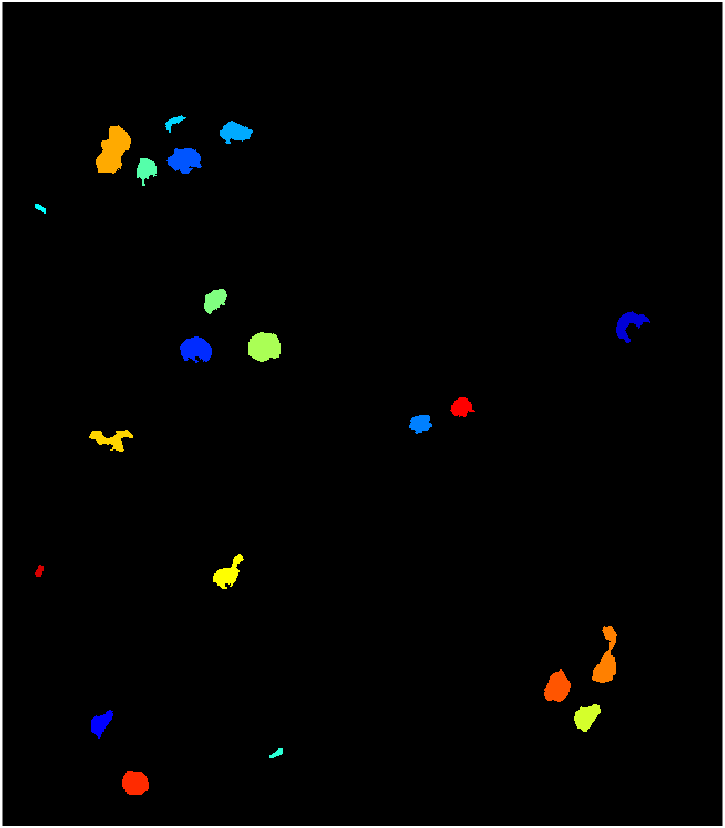

# 🫐 Contagem de Mirtilos com MATLAB

Este projeto faz parte dos meus estudos de **Visão Computacional**. O objetivo é isolar e contar mirtilos maduros em uma imagem.

## 🚀 Tecnologias e Conceitos
- **MATLAB**: Processamento de matrizes.
- **Espaço de Cores HSV**: Utilizado para isolar a cor azul (Hue) independente da iluminação (Value).
- **Morfologia Matemática**: Funções `imfill` e `bwareaopen` para remoção de ruído.
- **Análise de Componentes Conectados**: Função `bwconncomp` para a contagem final.

## 📸 Resultado
]

---

# 🫐 Automated Blueberry Counter (MATLAB)

This project is part of my **Computer Vision** studies. It focuses on identifying and counting ripe blueberries in an image by leveraging advanced image processing techniques.

## 🚀 Technologies & Concepts

- **MATLAB**: Used for matrix-based image processing and analysis.
    
- **HSV Color Space**: Unlike RGB, the HSV space allows for robust color segmentation by isolating the **Hue (H)** canal. This ensures that the detection remains accurate regardless of lighting variations or shadows (Value channel).
    
- **Mathematical Morphology**: Applied `imfill` to close gaps within detected objects and `bwareaopen` to remove non-target noise (small artifacts/leaves).
    
- **Connected Component Analysis (CCA)**: Utilized the `bwconncomp` function to uniquely identify and count each fruit as an individual object.
    

## 🛠️ How it Works

1. **Conversion**: The image is converted from RGB to HSV.
    
2. **Thresholding**: A specific range for the blue hue is applied to create a binary mask.
    
3. **Refinement**: Morphological filters clean up the mask.
    
4. **Quantification**: The algorithm counts the "islands" of pixels and labels them.
    

## 📸 Results

_
